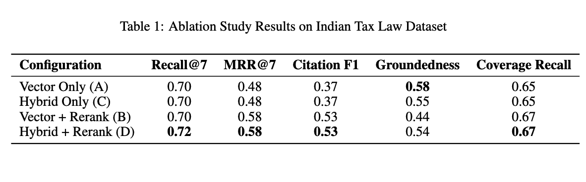
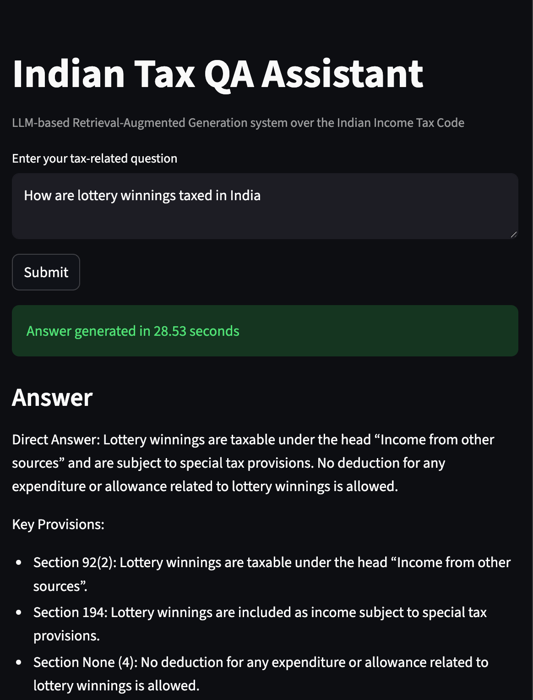

 # Metadata‑Augmented Hybrid RAG for Indian Tax Law

This repository contains the implementation and evaluation of a **Metadata‑Augmented Hybrid Retrieval‑Augmented Generation (RAG)** system for the **Indian Income‑tax Bill, 2025**.

The system targets **high‑precision legal question answering** with a strong emphasis on:

* retrieval recall and ranking quality,
* statutory citation fidelity,
* answer groundedness,
* and fully reproducible evaluation.

The project includes a controlled **ablation study** comparing vector, hybrid, and reranked pipelines on a curated golden test set.

---
## Run Locally

```bash
pip install -r requirements.txt
streamlit run app/main.py
```

---
## Project Overview

Indian tax legislation is deeply hierarchical (Chapters → Sections → Sub‑sections → Provisos) and exhibits heavy semantic overlap across provisions. Conventional RAG pipelines often fail due to:

* context fragmentation during chunking,
* vocabulary mismatch between lay queries and statutory language,
* retrieval of legally adjacent but incorrect sections (the *distractor problem*).

This system addresses these challenges through:

* **Structure‑aware ingestion** preserving statutory hierarchy
* **Query expansion for legal vocabulary alignment**
* **Hybrid dense + sparse retrieval**
* **Cross‑encoder reranking used strictly as a reordering step**
* **LLM‑based citation and groundedness evaluation**

---

## System Architecture

```
User Query
   ↓
Query Optimizer (legal vocabulary expansion)
   ↓
Retriever (Vector or Hybrid: Dense + BM25)
   ↓
Cross‑Encoder Reranker (optional, reorder‑only)
   ↓
Answer Generator (citation‑aware)
```

Each stage is independently ablated to isolate its contribution.

---

## Evaluation Methodology

### Dataset

Evaluation is performed on a **curated golden test set** derived directly from the *Income‑tax Bill, 2025*. Each query includes:

* a gold answer grounded strictly in statutory text,
* mandatory required section identifiers.

### Experimental Configurations

Four configurations are evaluated under identical chunking, embedding, and generation settings:

* **A — Vector (No Rerank)**
* **B — Vector + Rerank**
* **C — Hybrid (Dense + BM25, No Rerank)**
* **D — Hybrid + Rerank**

### Metrics

* **Recall@7**: Presence of required sections in top‑7 retrieved chunks
* **MRR@7**: Rank of the first correct statutory section
* **Citation Precision / Recall / F1**: Accuracy of cited sections in answers
* **Groundedness**: Degree of answer support from retrieved context
* **Coverage Recall**: Breadth of relevant statutory coverage

---

## Ablation Results



**Observation:**
Query expansion alone enables strong recall and stable coverage. Once legal vocabulary alignment is applied, hybrid retrieval offers limited additional gains over dense retrieval.

**Key Result:**
Cross‑encoder reranking significantly improves ranking quality and citation accuracy **without reducing recall**, provided it is applied strictly as a reordering step over a high‑recall candidate set.

---
## Demo

Below is a live demo of the system running locally via Streamlit.



The demo showcases end-to-end question answering over the Income-tax Bill, 2025,
including retrieval and generation latency.

